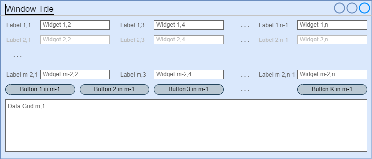
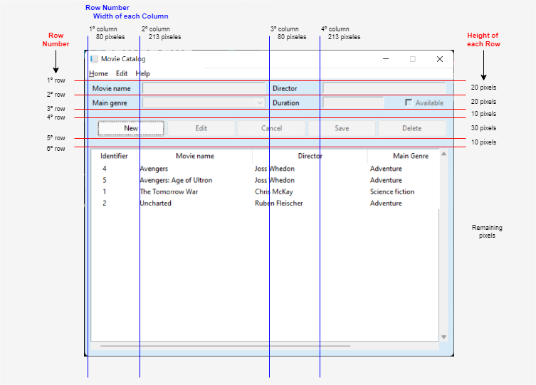

# Tkinter Fake Grid Layout over Place Manager

## Description 

This example simulates a Grid (rows x columns) inside a Tkinter Container based on the Place layout manager, thus calculating for each widget absolute coordinates (x, y).

So far I don't feel comfortable with Tkinter layout managers. Maybe because of my background in VB6, I prefer the positioning (pixel x, pixel y) on screen. 

Of course, the screen can be modeled as a grid of **m** rows by **n** columns, thus `(m x n)`. And inside each cell we can put a Tkinter widget, or even one could also span several columns, as shown in the mockup below:

<div align="center">
  
</div>

But for the row of buttons I propose a customised structure, which does not respect the columns of the grid. 

## Implementation
Unlike the dynamic dimensions of Tkinter's Grid Layout Manager, which are not so easy to control, I prefer fixed dimensions for rows and columns. Knowing what widgets a screen needs, those dimensions can be clearly set to achieve a screen layout as follows:

<div align="center">
  
</div>

The rows, columns and their dimensions for that screen were set using the following code snippet:
````python
# helper/layout.py

DEFAULT_TOP_MARGIN = 5

DEFAULT_ROW_HEIGHT = 20             # Default height for widgets
DEFAULT_LABEL_WIDTH = 80
DEFAULT_INPUT_WIDGET_WIDTH = 213    # Default width for input widgets, like (entry, combobox, ...)

DEFAULT_BUTTON_HEIGHT = DEFAULT_ROW_HEIGHT + int(DEFAULT_ROW_HEIGHT / 2)

DEFAULT_TREEVIEW_GRID_ROWS_COUNT = 10
DEFAULT_TREEVIEW_DATAGRID_WIDTH = 0     # Interpreted as the full width of the container
DEFAULT_TREEVIEW_DATAGRID_HEIGHT = int((DEFAULT_TOP_MARGIN + DEFAULT_ROW_HEIGHT) * DEFAULT_TREEVIEW_GRID_ROWS_COUNT)
. . .

DEFAULT_GRID_ROWS_HEIGHT = (DEFAULT_ROW_HEIGHT,                 # 1º row
                            DEFAULT_ROW_HEIGHT,                 # 2º row
                            int(DEFAULT_ROW_HEIGHT / 2),        # 3º row
                            DEFAULT_BUTTON_HEIGHT,              # 4º row
                            int(DEFAULT_ROW_HEIGHT / 2),        # 5º row
                            DEFAULT_TREEVIEW_DATAGRID_HEIGHT)   # 6º row

DEFAULT_GRID_COLUMNS_WIDTH = (DEFAULT_LABEL_WIDTH,              # 1º column 
                              DEFAULT_INPUT_WIDGET_WIDTH,       # 2º column
                              DEFAULT_LABEL_WIDTH,              # 3º column
                              DEFAULT_INPUT_WIDGET_WIDTH)       # 4º column
````

With the screen understood as a grid, but using Tkinter's Place Layout Manager to position the widgets, a mechanism is needed to translate the positioning (row, column) of the grid, to the positioning (pixel x, pixel y) of the Place Layout Manager. In this example project that mechanism is the function `get_place`, as follows:
````python
# helper/layout.py

DEFAULT_LEFT_MARGIN = 10
DEFAULT_TOP_MARGIN = 5

. . .

class FakeGridLayout:
    """
    Class to simulate a Grid (rows x columns) inside the Container based on the Place layout manager,
      thus calculating for each widget absolute coordinates (x, y).
    """
    def __init__(self,
                 rows_height_: () = DEFAULT_GRID_ROWS_HEIGHT,
                 columns_width_: () = DEFAULT_GRID_COLUMNS_WIDTH):
        self.__rows_height = rows_height_
        self.__columns_width = columns_width_

    def get_place(self,
                  row_number_: int,
                  col_number_: int) -> ():
        """
        Calculates the exact coordinates (x, y) to place the widget inside the parent container, obtained from a
          fake-grid mimicked by GRID_ROWS_HEIGHT and GRID_COLUMNS_WIDTH
        :param row_number_: where the widget will be placed inside the container
        :param col_number_: where the widget will be placed inside the container
        :return: coordinates (x, y) to Place the widget inside the container
        """
        x_ = sum(self.__columns_width[:col_number_ - 1]) + DEFAULT_LEFT_MARGIN * col_number_
        y_ = sum(self.__rows_height[:row_number_ - 1]) + DEFAULT_TOP_MARGIN * row_number_
        return x_, y_
````

Note that each widget is expected to have a left margin and a top margin.

## Use
And that's it for a fake grid layout based on Place Layout Manager. Then you can use it and adjust it to achieve custom positioning for some widgets, as you can see in the method:
````python
# view/gui.py

def __create_widgets(self):
    """
    Create and add the widgets to the container thought as a grid, but positioning them after translation to Place positioning
    """
    . . .
````

The sample project implements the CRUD of a catalog of movies, based on the YouTube video [Python con Tkinter y Base de datos - Aplicación de escritorio (Catalogo de Peliculas)](https://www.youtube.com/watch?v=7QqDQEZ3FTI&ab_channel=Roelcode), which you can watch if you want to practice your Spanish.

## Platform

### Development 
Python 3.10.4 on Windows 11 

### Requirements
```
pip install -r requirements.txt  
```
